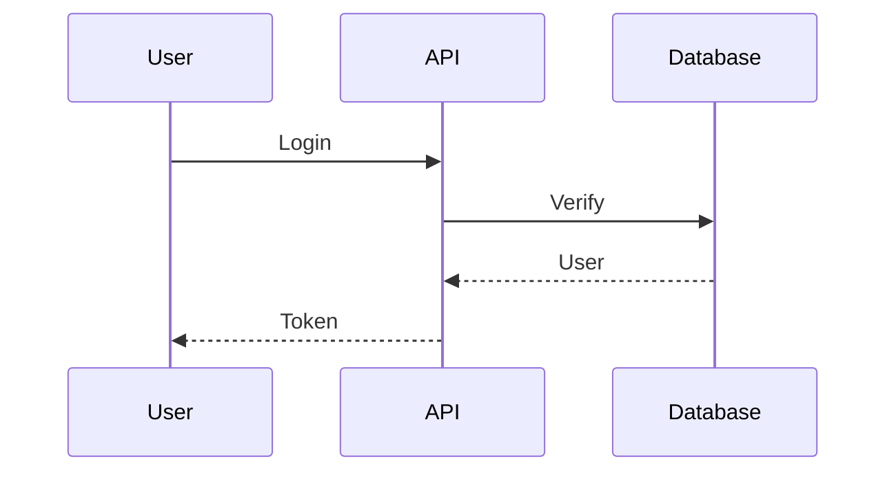

# Domain Documentation Analysis

## Your Task

Analyze the domain files and create comprehensive business documentation. Write pure Markdown to **`{{OUTPUT_FILE}}`**.

**Use `write_file` once to save your complete Markdown documentation.**

## Available Tools

- `read_file`: Read file contents
- `list_directory`: List directory contents
- `search_files`: Find files by pattern
- `write_file`: Save output to `{{OUTPUT_FILE}}`

## Target Files

- **Codebase**: `{{CODEBASE_PATH}}`
- **Domain**: `{{DOMAIN_NAME}}` (ID: `{{DOMAIN_ID}}`)
- **Files**:
  {{#each FILES}}
  - {{this}}
    {{/each}}

## Documentation Structure

Create Markdown documentation with these sections:

1. **Title & Overview** - Domain name and 1-2 sentence description
2. **Core Responsibilities** - Bullet list of key functions
3. **Architecture Diagrams** - Mermaid diagrams showing:
   - Sequence diagrams for API flows
   - Flowcharts for business logic
   - Architecture diagrams for component relationships
   - State machines for lifecycle management
4. **Why It Matters** - Business value and impact
5. **Key Components** - Main files and their purposes
6. **Risk Areas** - Security and performance concerns

**Use Mermaid diagrams extensively.** One diagram replaces paragraphs of text.

## Example Output

````markdown
# User Authentication

Handles user login, session management, and access control.

## Core Responsibilities

- Validate credentials
- Generate JWT tokens
- Manage sessions

## Authentication Flow


````

## Why it matters

Authentication secures the platform...

## Key Components

**File**: `auth/service.js` - Handles password validation

## Risk Areas

- Password security
- Token expiration

```

## Execution

1. Read all files using `read_file`
2. Create comprehensive Markdown documentation with multiple Mermaid diagrams
3. Save complete Markdown to `{{OUTPUT_FILE}}` using `write_file`
4. Exit

```

```

```
