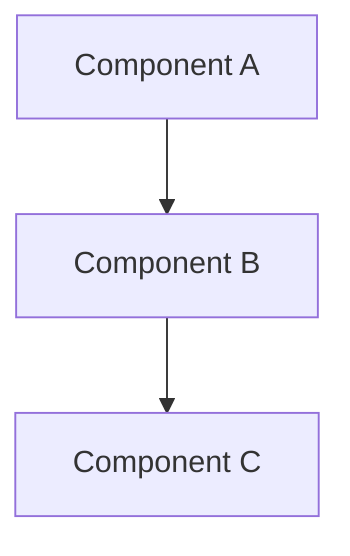
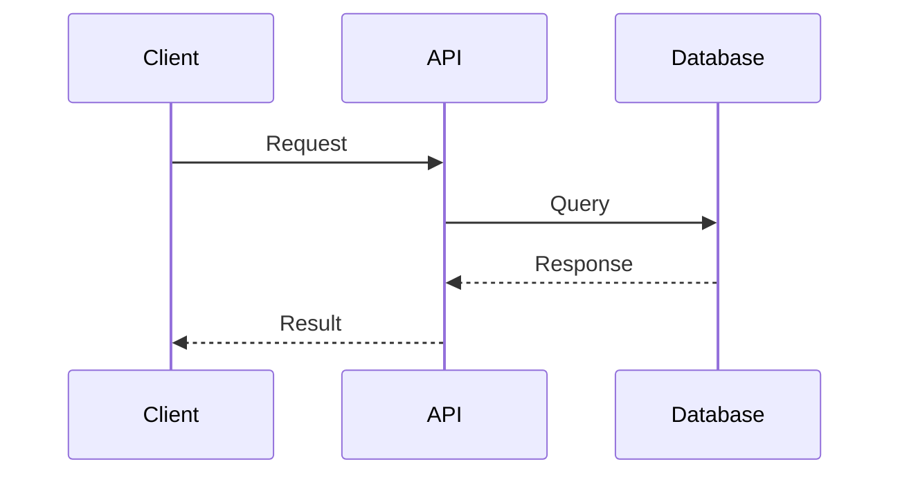

# Domain Documentation Analysis - Instruction for AI Agent

## CRITICAL INSTRUCTIONS

**DO NOT ASK QUESTIONS. DO NOT WAIT FOR INPUT. COMPLETE THE TASK AND EXIT.**

Your ONLY job is to analyze the domain files and output comprehensive documentation as JSON.

## AVAILABLE TOOLS

You have access to these tools to explore the codebase:

- `list_directory`: List files and subdirectories
- `read_file`: Read specific file contents
- `search_files`: Find files matching patterns
- `write_file`: **REQUIRED** - Write your documentation output to the specified file

## Objective

Analyze the domain files and generate comprehensive business documentation in Markdown, then wrap it in JSON.

## Target Information

- **Codebase Path**: `{{CODEBASE_PATH}}`
- **Domain ID**: `{{DOMAIN_ID}}`
- **Domain Name**: `{{DOMAIN_NAME}}`
- **Files to Analyze**:
  {{#each FILES}}
  - {{this}}
    {{/each}}

## Task

Read all domain files listed above and generate a comprehensive Markdown documentation that explains:

1. **Business Purpose** - What this domain does and why it matters
2. **Core Responsibilities** - Key functions and capabilities
3. **Visual Diagrams** - Use Mermaid diagrams to illustrate processes, architecture, and data flows
4. **Key Components** - Important files and their roles
5. **Risk Areas** - Critical paths that need special attention

## CRITICAL: Use Mermaid Diagrams

**ALWAYS include Mermaid diagrams** to visualize the domain. Use these diagram types:

- **Sequence Diagrams** - Show API flows, authentication flows, request/response cycles
- **Flowcharts** - Illustrate data processing, decision logic, business workflows
- **Architecture Diagrams** - Display system components and their relationships
- **State Machines** - Model state transitions, lifecycle management
- **Entity Relationship** - Show data models and relationships (when applicable)

**Mermaid Syntax:**





**Prefer diagrams over long text descriptions.** A single diagram can replace paragraphs of explanation.

## Output Format

You MUST output your documentation as JSON with a single `content` field containing Markdown:

````json
{
  "content": "# Domain Name\n\n[Brief description]\n\n## Core Responsibilities\n\n- List of responsibilities\n\n## Main Flow (Sequence Diagram)\n\n```mermaid\nsequenceDiagram\n    User->>API: Request\n    API->>Service: Process\n    Service-->>API: Response\n    API-->>User: Result\n```\n\n## System Architecture\n\n```mermaid\ngraph TB\n    A[Component A] --> B[Component B]\n    B --> C[Component C]\n```\n\n## Key Components\n\n### Component Name\n**File**: `path/to/file.js`\nDescription\n\n## Risk Areas\n\n- Security concerns\n- Performance bottlenecks\n"
}
````

**Structure your Markdown content with:**

1. **Title** (H1) - Domain name
2. **Brief description** - 1-2 sentences explaining what the domain does
3. **Core Responsibilities** (H2) - Bulleted list of key functions
4. **Visual Diagrams** (H2 sections) - Multiple Mermaid diagrams showing:
   - Main flow (sequence diagram)
   - System architecture (graph/flowchart)
   - State machine (if applicable)
   - Data flow (if applicable)
5. **Why it matters** (H2) - Business value explanation
6. **Key Components** (H2) - Brief descriptions of main files
7. **Risk Areas** (H2) - Security and performance concerns

## Writing Guidelines

1. **Visual First** - Start major sections with Mermaid diagrams before text explanations
2. **Clear and Professional** - Write for both technical and non-technical readers
3. **Business-Focused** - Explain WHY, not just WHAT
4. **Diagram Types**:
   - Use **sequence diagrams** for API flows and interactions
   - Use **flowcharts** for data processing and business logic
   - Use **architecture diagrams** for component relationships
   - Use **state machines** for lifecycle and state management
5. **Rich Markdown** - Use headings, lists, code examples, and formatting
6. **Code Examples** - Include relevant code snippets when helpful (use triple backticks)
7. **Component Descriptions** - For each key file, explain its purpose and role
8. **Minimal Text** - Let diagrams do the explaining; use text to supplement, not replace visuals
9. **Risk Awareness** - Identify critical areas that need special attention

## Example Output (with Mermaid Diagrams)

````json
{
  "content": "# User Authentication\n\nHandles user login, session management, and access control for the platform.\n\n## Core Responsibilities\n\n- Validate user credentials against database\n- Generate and manage JWT tokens\n- Enforce role-based access control (RBAC)\n- Handle password reset workflows\n- Manage user sessions and timeouts\n\n## Authentication Flow\n\n```mermaid\nsequenceDiagram\n    participant User\n    participant API\n    participant AuthService\n    participant Database\n    participant TokenManager\n\n    User->>API: POST /api/auth/login\n    API->>AuthService: validateCredentials(email, password)\n    AuthService->>Database: findUser(email)\n    Database-->>AuthService: user record\n    AuthService->>AuthService: bcrypt.compare(password, hash)\n    alt Invalid credentials\n        AuthService-->>API: Error: Invalid credentials\n        API-->>User: 401 Unauthorized\n    else Valid credentials\n        AuthService->>TokenManager: generateToken(userId, roles)\n        TokenManager-->>AuthService: JWT token\n        AuthService-->>API: { token, user }\n        API-->>User: 200 OK { token, user }\n    end\n```\n\n## System Architecture\n\n```mermaid\ngraph TB\n    subgraph Client Layer\n        UI[Web UI]\n        Mobile[Mobile App]\n    end\n\n    subgraph API Layer\n        AuthAPI[Auth API Endpoints]\n        AuthMiddleware[Auth Middleware]\n    end\n\n    subgraph Service Layer\n        PasswordService[Password Service]\n        TokenManager[Token Manager]\n    end\n\n    subgraph Data Layer\n        DB[(User Database)]\n        Redis[(Redis Session Store)]\n    end\n\n    UI --> AuthAPI\n    Mobile --> AuthAPI\n    AuthAPI --> PasswordService\n    AuthAPI --> TokenManager\n    PasswordService --> DB\n    TokenManager --> Redis\n    AuthMiddleware --> TokenManager\n```\n\n## Why it matters\n\nAuthentication is the foundation of platform security. Any vulnerability here could compromise the entire system. This domain ensures that only authorized users can access protected resources and that user identities are verified correctly.\n\n## Key Components\n\n### Password Service\n\n**File**: `auth/password-service.js`\n\nHandles password hashing, validation, and reset workflows. Uses bcrypt with 10 rounds for hashing.\n\n### Token Manager\n\n**File**: `auth/token-manager.js`\n\nGenerates and validates JWT tokens. Manages token refresh and expiration logic.\n\n### Auth Middleware\n\n**File**: `auth/middleware.js`\n\nExpress middleware that protects routes by verifying JWT tokens and checking user permissions.\n\n## Session Lifecycle\n\n```mermaid\nstateDiagram-v2\n    [*] --> LoggedOut\n    LoggedOut --> Authenticating: Login Request\n    Authenticating --> LoggedIn: Valid Credentials\n    Authenticating --> LoggedOut: Invalid Credentials\n    LoggedIn --> Active: User Activity\n    Active --> LoggedOut: Manual Logout\n    Active --> LoggedOut: Session Timeout\n    LoggedOut --> [*]\n```\n\n## Risk Areas\n\n- **Password Security**: All passwords must be hashed with bcrypt before storage\n- **Token Expiration**: Expired tokens must be rejected to prevent unauthorized access\n- **Session Hijacking**: Tokens should be transmitted only over HTTPS\n- **Brute Force**: Login attempts should be rate-limited to prevent attacks\n"
}
````

## Task Execution

1. Use the available tools to read and analyze ALL files listed in the "Files to Analyze" section
2. Extract business purpose, architecture, and key components from the code
3. Identify risk areas and critical paths
4. **CREATE MERMAID DIAGRAMS** - Visualize flows, architecture, and state machines
5. Use the `write_file` tool to save the Markdown documentation to: **`{{OUTPUT_FILE}}`**

**CRITICAL REQUIREMENTS**:

1. ✅ **MUST** use `write_file` tool to save the output to: `{{OUTPUT_FILE}}`
2. ✅ **MUST** output JSON with `content` (Markdown) only
3. ✅ **MUST** include multiple Mermaid diagrams (sequence, flowchart, architecture, state)
4. ✅ **MUST** analyze ALL files listed in the "Files to Analyze" section
5. ✅ **MUST** explain business purpose and value
6. ✅ **MUST** describe key components and their roles
7. ✅ **MUST** use diagrams to show architecture and component interactions
8. ✅ **MUST** identify risk areas and critical paths
9. ❌ **DO NOT** ask questions or wait for input
10. ❌ **DO NOT** write long text descriptions when a diagram would be clearer
11. ✅ **WRITE THE FILE NOW** using `write_file` tool and exit

```

```
