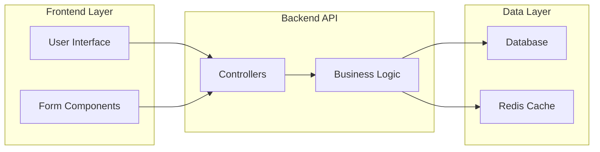
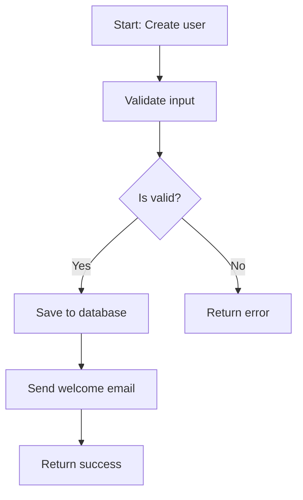
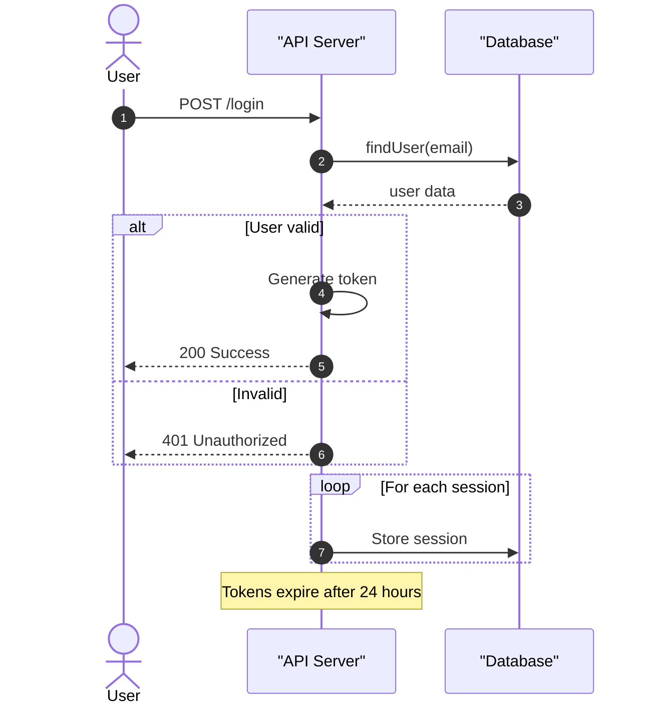
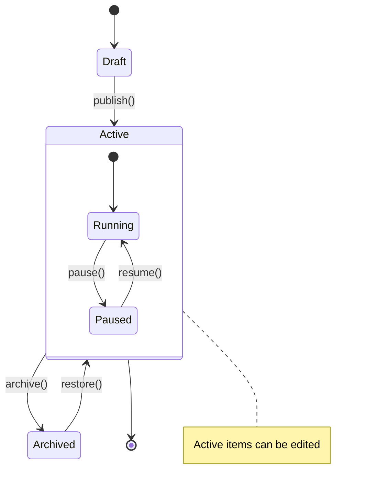
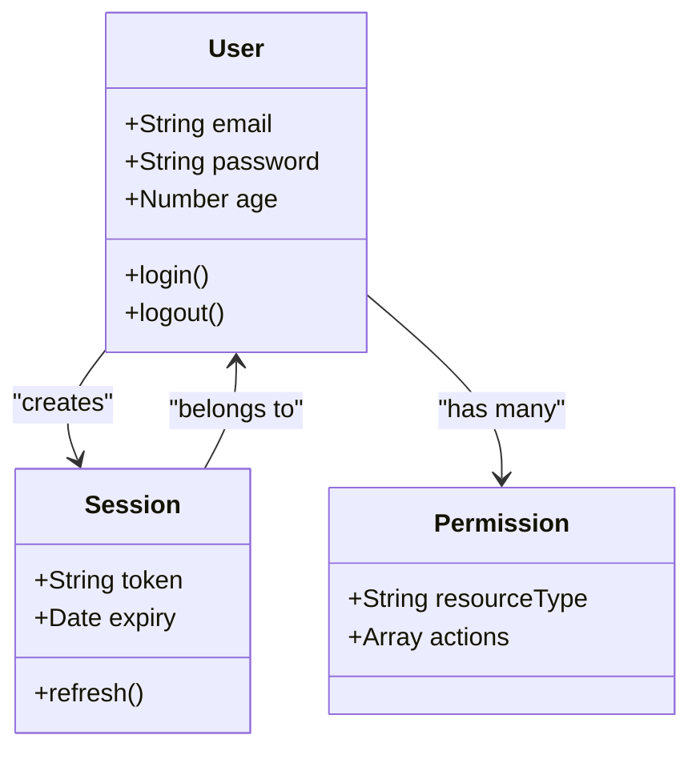
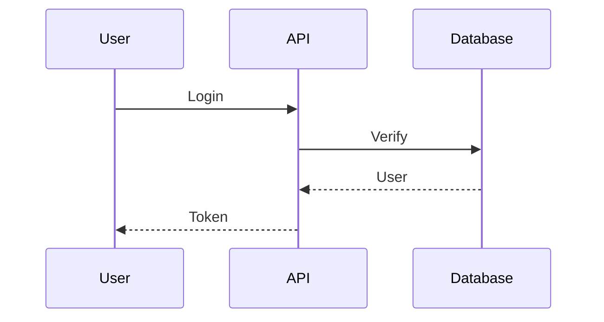

# Domain Documentation Analysis

## Your Task

Analyze the domain files and create comprehensive business documentation. Write pure Markdown to **`{{OUTPUT_FILE}}`**.

**Use `write_file` once to save your complete Markdown documentation.**

## Available Tools

- `read_file`: Read file contents
- `list_directory`: List directory contents
- `search_files`: Find files by pattern
- `write_file`: Save output to `{{OUTPUT_FILE}}`

## Target Files

- **Codebase**: `{{CODEBASE_PATH}}`
- **Domain**: `{{DOMAIN_NAME}}` (ID: `{{DOMAIN_ID}}`)
- **Files**:
  {{#each FILES}}
  - {{this}}
    {{/each}}

## Documentation Structure

Create Markdown documentation with these sections:

1. **Title & Overview** - Domain name and 1-2 sentence description
2. **Core Responsibilities** - Bullet list of key functions
3. **Architecture Diagrams** - Mermaid diagrams showing:
   - Sequence diagrams for API flows
   - Flowcharts for business logic
   - Architecture diagrams for component relationships
   - State machines for lifecycle management
4. **Why It Matters** - Business value and impact
5. **Key Components** - Main files and their purposes
6. **Risk Areas** - Security and performance concerns

**Use Mermaid diagrams extensively.** One diagram replaces paragraphs of text.

## ⛔ Mermaid Compatibility Rules (Read Before Writing Any Diagram)

These mistakes cause parse failures in the documentation renderer:

| ❌ Invalid                                     | ✅ Valid                                             |
| ---------------------------------------------- | ---------------------------------------------------- |
| `loop For each watch`                          | `loop per_watch` + `%% For each watch` comment below |
| `loop Notifications`                           | `loop per_notification`                              |
| `note for Node "text"`                         | `%% text` inside block, or explain in Markdown prose |
| `note for Node "text"` in flowchart            | Remove entirely; flowcharts don't support notes      |
| Nested `alt/else/alt` with missing outer `end` | Count every opened block and add a matching `end`    |
| `note over A,B` inside a loop or alt block     | Move `note over` outside the loop/alt block          |

**Nesting checklist:** Before finalising a sequence diagram, count all `alt`/`loop`/`opt`/`par`/`rect` openings and verify there is a matching `end` for each one.

## Mermaid Diagram Examples

**Use these patterns for correct Mermaid syntax:**

### Flowchart (with subgraphs)



**Key points:**

- Flowchart directions: `LR` (left-right) or `TD` (top-down)
- Multiple subgraphs: `subgraph ID["Label"]`
- Connections between subgraphs work automatically

### Flowchart (with decisions)



**Key points:**

- Diamond nodes: `{label}` - no quotes inside braces
- Labels with special chars: use quotes `["Label with /path:chars()"]`
- Comments: separate line with `%%`
- Flowcharts don't support `note` syntax - use comments or text nodes instead

### Sequence Diagram (with loops and alternatives)



**Key points:**

- Simple Note text - avoid `<`, `>`, `=>`, semicolons
- Use descriptive words instead of operators
- Place Notes outside loops and alt blocks when possible
- `alt`/`else` for conditionals, `loop` for iterations
- ❌ **Loop/alt/opt labels must be single identifiers — no spaces.** `loop per_watch` ✅ — `loop For each watch` ❌. Put the human description in a `%%` comment on the next line.
- ❌ **Every `alt`, `loop`, `opt`, `par`, `rect` block must have its own matching `end`.** When nesting (e.g. `alt` inside `else` inside `alt`), count the `end` keywords — one per opened block. A missing `end` on the outer block is the most common cause of autonumber/note parse errors at the end of the diagram.
- ❌ **Never use `note for X "text"`** in sequence diagrams. Use `note over A,B: text` or `note right of A: text`, or move the note outside the mermaid block entirely.

### State Diagram (with nested states)



**Key points:**

- Use `stateDiagram-v2` (not v1)
- Nested states: `state Name { ... }`
- Transitions: `From --> To: label`
- Notes: `note right of StateName : Note text` (single colon, no `end note`)

### Class Diagram (with relationships)



**Key points:**

- Relationships: `-->` (association), `--|>` (inheritance)
- Labels on relationships: `Class1 --> Class2 : "label"`
- Visibility: `+` public, `-` private, `#` protected
- ❌ **Never use `note for X "text"`** — it is NOT valid in flowcharts or class diagrams in most Mermaid versions and causes parse errors. Use `%% comment` inside the block or explain in surrounding Markdown prose instead.

## Example Output

````markdown
# User Authentication

Handles user login, session management, and access control.

## Core Responsibilities

- Validate credentials
- Generate JWT tokens
- Manage sessions

## Authentication Flow


````

## Why it matters

Authentication secures the platform...

## Key Components

**File**: `auth/service.js` - Handles password validation

## Risk Areas

- Password security
- Token expiration

```

## Execution

1. Read all files using `read_file`
2. Create comprehensive Markdown documentation with multiple Mermaid diagrams
3. Save complete Markdown to `{{OUTPUT_FILE}}` using `write_file`
4. Write `# Done` to `{{PROGRESS_FILE}}`
5. Exit

```

```

```
